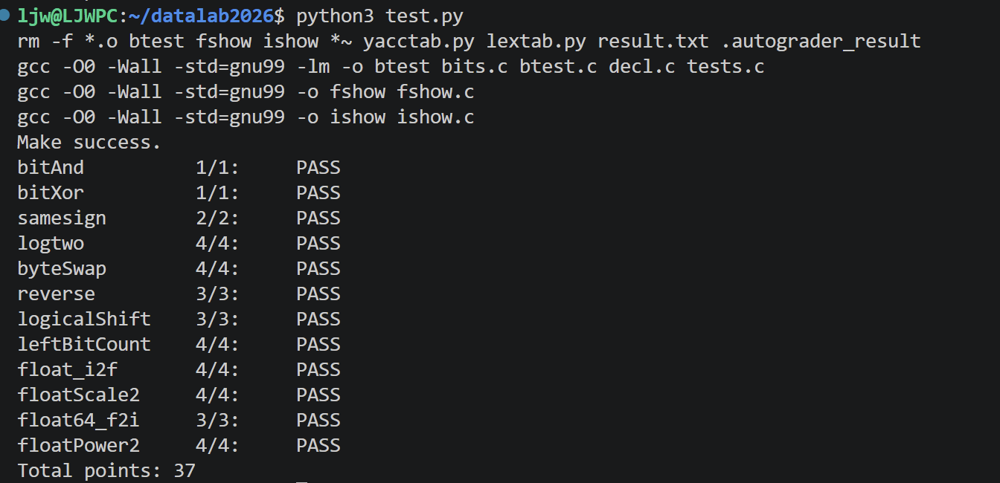

# datalab 报告

姓名：林佳雯

学号：2025200718

| 总分 | bitAnd | bitXor | samesign | logtwo | byteSwap | reverse | logicalShift | leftBitCount | float_i2f | floatScale2 | float64_f2i | floatPower2 |
| ---- | ---- | ---- | ---- | ---- | ---- | ---- | ---- | ---- | ---- | ---- | ---- | ---- |
| 37 | 1 | 1 | 2 | 4 | 4 | 3 | 3 | 4 | 4 | 4 | 3 | 4 |

test 截图：

## 解题报告

### 亮点

1. leftBitCount —— 用二分思想统计前导 1，符合操作符限制且代码精简
2. float_i2f —— 整数转浮点，涉及舍入（round-to-nearest-even）与进位，逻辑最完整
3. logtwo —— 把"判断"本身变成移位量和计数值，一步求出最高位位置
4. reverse —— 用 while 循环配合位提取实现位序反转

## 反馈/收获/感悟/总结

这个 lab 让我理解了补码、位运算和 IEEE 754 浮点格式，也体会到"只用受限操作符"好难啊。
